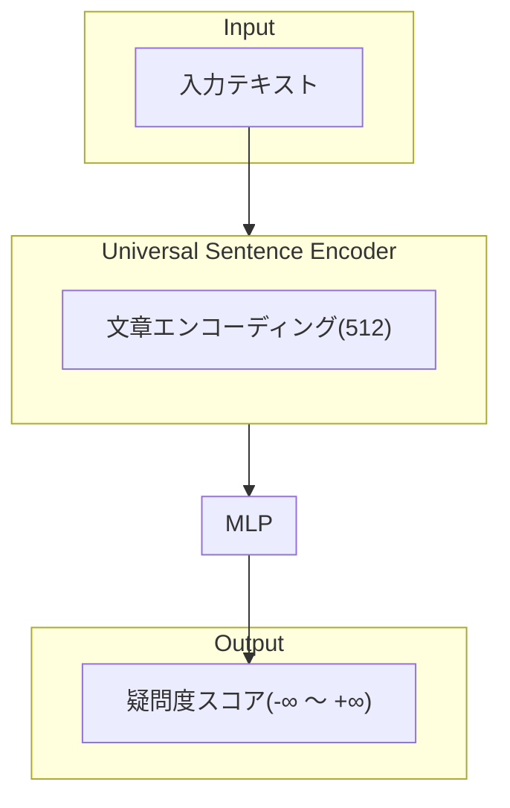

# 疑問をスコア化するモデル

## 仮想環境作成
```bash
export ENV_NAME=gyuwan_question_scoring
conda create -n  $ENV_NAME python=3.10 anaconda
conda activate $ENV_NAME
pip3 install -r requirements.txt
```

## モデル設計


## 損失関数
はい、損失関数を数式で表現してみましょう。

| 記号 | 意味 |
| --- | --- |
| $x_i$ | 文章 $i$ のUniversal Sentence Encodingによる特徴ベクトル |
| $y_i$ | 文章 $i$ の真のレベル（非疑問文は-1、疑問文は1-10） |
| $f_θ(x_i)$ | モデルによる予測スコア |
| $N$ | バッチサイズ |
| $α, β$ | 損失項の重み係数 |
| $m$ | マージン（スコア間の最小差） |

$$L = L_{base} + αL_{non} + βL_{rank}$$


### 基本損失（MSE）
$$L_{base} = \frac{1}{N}\sum_{i=1}^N (y_i - f_θ(x_i))^2$$

### 非疑問文に対する制約（ヒンジ損失）:
$$L_{non} = \frac{1}{N}\sum_{i=1}^N \mathbb{1}_{[y_i < 0]} \max(0, f_θ(x_i) + m)$$

ここで、$\mathbb{1}_{[y_i < 0]}$ は $y_i$ が負の時に1、それ以外で0をとる指示関数

### 順序関係を保持するためのランキング損失
$$L_{rank} = \frac{1}{N^2}\sum_{i=1}^N\sum_{j=1}^N \max(0, -(f_θ(x_i) - f_θ(x_j))\text{sign}(y_i - y_j) + m|y_i - y_j|)$$